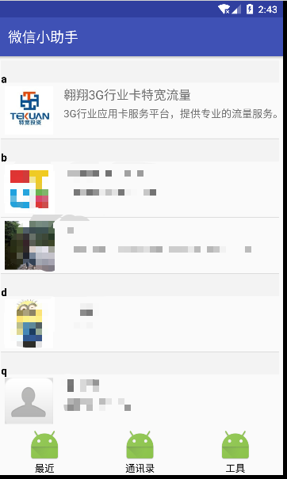
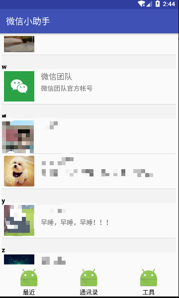
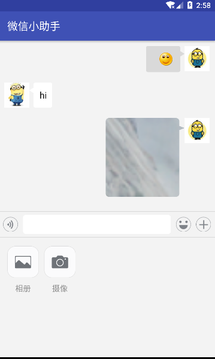
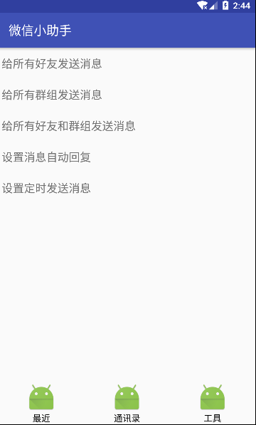

<h2>Web微信API接口在安卓下的实现</h2>

<h3>what is it</h3>







web微信api接口的封装库，在安卓上实现了web微信的大部分功能：诸如：个人微信号的登录，好友获取，消息收发，等等，借助这个库你可以实现web微信的大部分功能。


<h3>what it can do</h3>
已经实现的功能如下：

	1.个人微信号登录
	2.多种类型消息收取
	3.文字消息发送
	4.图片消息发送
	5.视频消息发送
	
待实现的功能：
	
	1.退出登录
	2.消息撤回
	3.文件消息发送

<h3>how to use it</h3>
使用步骤较为简单

库：wechatutil

使用示例:app

第一步，初始化

```
public class MainApp extends Application {
private static WechatManager wechatManager;
	@Override
    public void onCreate() {
        super.onCreate();
        wechatManager=WechatManager.init(this);
    }
    
    public static WechatManager getWechatManager() {
        return wechatManager;
    }
}
```

第二步，在需要登录的地方检查登录状态，如果已经登录则可以继续下一步，否则获取二位码，进行登录操作

```
public class WeChatLoginActivity extends BaseActivity {
	@Override
    protected void onCreate(Bundle savedInstanceState) {
    	  super.onCreate(savedInstanceState);
        setContentView(R.layout.activity_we_chat_qr_code);
        weChatLoginHelper =wechatManager.getLoginHelper();
        weChatLoginHelper.syncCheck(new LoginHelper.SyncCheckListener() {
            @Override
            public void onReturn(boolean isSuccess,String selector) {
                if (isSuccess){
                    //登录状态有效，不需要重新登录
                }else {
                		//登录状态无效，获取二维码，重新登录
                    fetchQr();
                }
            }
        });
    }
    
   private void fetchQr(){
        weChatLoginHelper.login(new LoginHelper.LoginListener() {
            @Override
            public void onUUid(String uuid) {
            		//获取到uuid，将使用uuid去获取登录用的二维码
                Glide.with(WeChatLoginActivity.this).load(urlManager.qrCodeUrl(uuid)).into(qrIv);
            }

            @Override
            public void onSuccess() {
            		//手机扫描了二维码，并点击了登录
                onLoginSuccess();
            }

            @Override
            public void onRefetchUUid() {
					//二维码已经超时，此时重新获取uuid
            }

            @Override
            public void onError(Throwable th) {
					//其它异常情况
            }
        });
    }

}
```

第三步，开始接收消息

```
 MainApp.getWechatManager().getMsgHelper().startCheckMsg();
 
 @Subscribe(threadMode = ThreadMode.MAIN)
 public void onMessageEvent(AddMsgList message) {
     String fromName = message.getFromUserName();
     //对消息进行解析并处理
  }
```

好友列表接口：

```
loginHelper.getBaseInfo().getContactList();   //获取最近聊天好友列表
loginHelper.getContacts();//获取所有好友
```
消息接口：

```
msgHelper.sendTextMsg(messageInfo, contact,new MsgHelper.SendMsgListener(){
	@Override
    public void onSended(boolean isSuccess, String result, MessageInfo msgInfo) {
        if (isSuccess) {
        	//发送成功
            msgInfo.setSendState(Constants.CHAT_ITEM_SEND_SUCCESS);
        } else {
        	//发送失败
            msgInfo.setSendState(Constants.CHAT_ITEM_SEND_ERROR);
        }
        chatAdapter.notifyDataSetChanged();
    }
});

msgHelper.sendVideo(messageInfo, contact,listener);
msgHelper.sendImage(messageInfo, contact,listener);

```

<h3>如何扩展</h3>
1.优化消息解析，对类com.donute.wechat.utils.MessageParser进行补充完善即可。

2.所有接口的url地址，可在类com.donute.wechat.helpers.UrlManager中找到

3.消息类型定义可在com.donute.wechat.beans.msg.MsgType中找到

###感谢

使用示例使用了：https://github.com/Rance935/ChatUI

接口地址及格式参考了：https://github.com/littlecodersh/ItChat
